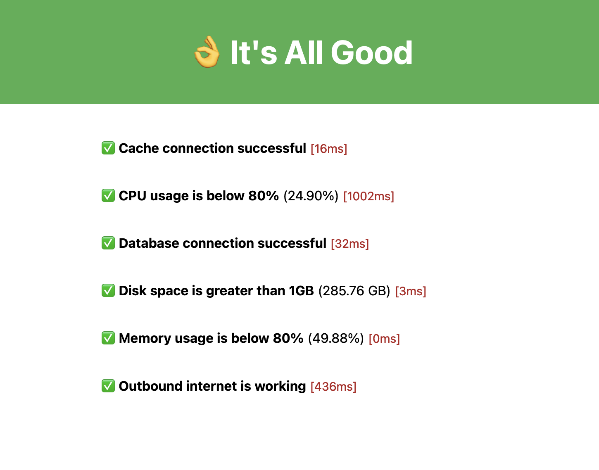
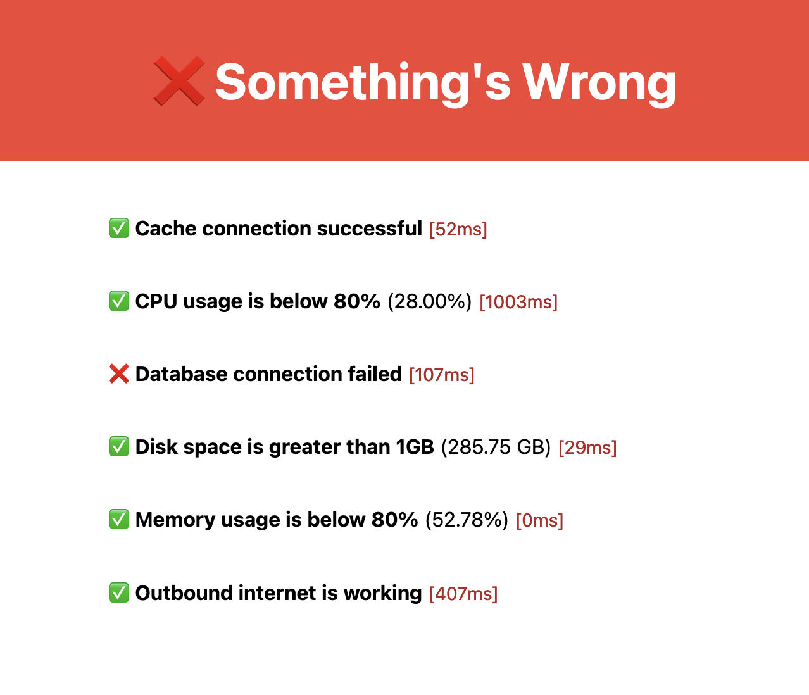

<center>
  <h1>👌 Allgood</h1>
  
</center>

Check your app is Allgood with a beautiful `/healthcheck` page and API.
Compatible with Express, Fastify, Hono and NextJS.

Use it for smoke tests, monitoring, debugging and alerting. It can be used as a healthcheck page for UptimeRobot or similar monitoring services.

Inspired by the [RubyGem of the same name](https://github.com/rameerez/allgood).

## Install
```
npm i -s allgood
yarn add allgood
pnpm add allgood
```

Next, add a healthcheck route to your app. We have examples below for popular frameworks.

## Examples

### Express
```js
import express from "express";
import { createHealthCheck } from 'allgood';

const app = express();

const healthCheck = createHealthCheck({
  db_connection_string: process.env.DATABASE_URL,
  cache_connection_string: process.env.REDIS_URL,
  checks: { // default checks
    db_connection: false,
    db_migrations: false,
    cache_connection: false,
    disk_space: true,
    memory_usage: true,
    outbound_internet: true,
    cpu_usage: true
  },
});

app.get("/healthcheck", healthCheck);

app.listen(3000, () => {
  console.log("Express server running on http://localhost:3000");
});
```

### Fastify
```js
import fastify from 'fastify'
import { createHealthCheck } from 'allgood';

const app = fastify()

const healthCheck = createHealthCheck({
  db_connection: process.env.DATABASE_URL,
  cache_connection: process.env.REDIS_URL,
  checks: {
    db_connection: true,
    cache_connection: true,
  },
})

// Health check route
app.get('/healthcheck', healthCheck)

// Run the server!
const start = async () => {
  try {
    await app.listen({ port: 3000 })
  } catch (err) {
    app.log.error(err)
    process.exit(1)
  }
}

start()
```

### Hono
```js
import { Hono } from 'hono'
import { serve } from '@hono/node-server'
import { createHealthCheck } from 'allgood';

const app = new Hono()

const healthCheck = createHealthCheck({
  db_connection: process.env.DATABASE_URL,
  cache_connection: process.env.REDIS_URL,
  checks: {
    db_connection: true,
    cache_connection: true,
  },
})

app.get('/healthcheck', healthCheck)

const PORT = 3000
console.log(`Server is running on port ${PORT}`)

serve({
  fetch: app.fetch,
  port: PORT
})
```

### API
Allgood will also return a JSON object with healthcheck information for programmatic usage.
Here is an example of what it will return:

`curl --request GET --url http://api.example.com/healthcheck`
```json
{
  "status": "pass",
  "description": "Health check response, generated by allgood.",
  "results": {
    "memory_usage": {
      "status": "pass",
      "value": "54.09%",
      "componentName": "memory",
      "message": "Memory usage is below 80%",
      "time": 0
    },
    "disk_space": {
      "status": "pass",
      "value": "288.37 GB",
      "componentName": "disk",
      "message": "Disk space is greater than 1GB",
      "time": 34
    },
    "cache_connection": {
      "componentName": "cache_connection",
      "status": "pass",
      "message": "Cache connection successful",
      "value": "true",
      "time": 50
    },
    "db_connection": {
      "componentName": "db_connection",
      "status": "pass",
      "message": "Database connection successful",
      "value": "true",
      "time": 155
    },
    "outbound_internet": {
      "status": "pass",
      "value": "true",
      "componentName": "egress",
      "message": "Outbound internet is working",
      "time": 434
    },
    "cpu_usage": {
      "status": "pass",
      "value": "32.09%",
      "componentName": "cpu",
      "message": "CPU usage is below 80%",
      "time": 1002
    }
  }
}
```

## What if my app is not running?
Good point! Allgood will only work whilst your app does. But, if your monitoring service is calling `/healthcheck`, it will simply timeout.

## Do I have to use /healthcheck?
Nope, add it anywhere you want.

## How does the page look when it's not all good?


## License
TL;DR: Use it however you want, just don't blame me if it blows up or distribute a closed source version.
[GNU General Public License v3.0](https://choosealicense.com/licenses/gpl-3.0/)
